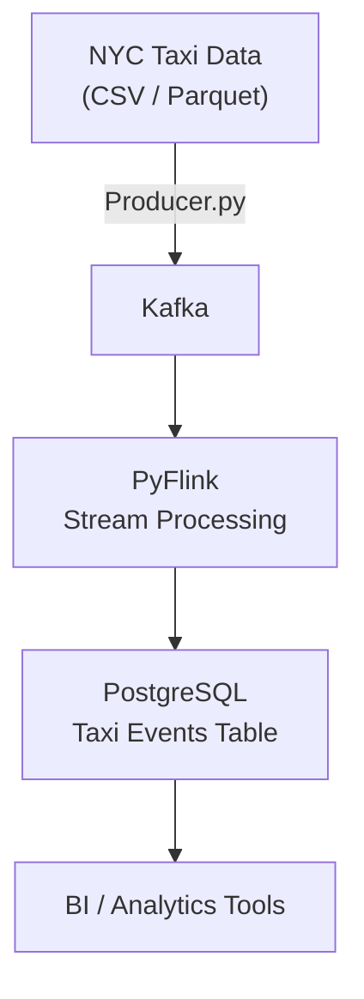

# NYC Taxi Streaming Pipeline 🚕📊

A real-time data engineering project that streams **NYC Taxi Trip data** from a producer into **Kafka**, processes it with **PyFlink**, and stores the transformed results into **PostgreSQL** for downstream analytics.  

---

## 📌 Project Overview
This project simulates a **real-time streaming pipeline**:
1. **Producer (Python)**  
   Reads NYC Taxi trip data (Parquet/CSV) and sends events into **Kafka**.
2. **Kafka**  
   Acts as the **message broker** to handle real-time event streams.
3. **PyFlink**  
   Consumes events from Kafka, applies simple **transformations**, and prepares data for storage.
4. **PostgreSQL**  
   Stores processed trip records for analytics, BI dashboards, and reporting.

---

## ⚙️ Tech Stack
- **Apache Kafka** – Event streaming platform  
- **Apache Flink (PyFlink)** – Real-time stream processing  
- **PostgreSQL** – Analytical database  
- **Docker Compose** – Container orchestration  
- **Python** – Data producer & ETL logic  

---
## 🏗️ Architecture



## 🚀 Getting Started

### 1️⃣ Clone Repository
```bash
git clone https://github.com/your-username/nyc-taxi-streaming-pipeline.git
cd nyc-taxi-streaming-pipeline
  ```

### 2️⃣Start Services with Docker
```bash
   docker-compose up -d
```

This starts:

- Kafka broker
- Flink (JobManager + TaskManager)
- PostgreSQL
- PGAdmin

### 3️⃣ Run Producer (send taxi trip events to Kafka)
- cd src/producers
- python producer.py

### 4️⃣ Submit Flink Job (consume + transform + write to Postgres)
``` bash
docker cp src/job/taxi_job.py flink-jobmanager:/opt/flink/usrlib/
docker exec -it flink-jobmanager ./bin/flink run -py /opt/flink/usrlib/taxi_job.py
```
### 📂 Project Structure
```bash
nyc-taxi-streaming-pipeline/
│── docker-compose.yml      # Service definitions
│── src/
│   ├── producers/
│   │   └── producer.py     # Sends NYC taxi events to Kafka
│   └── job/
│       └── taxi_job.py     # PyFlink job (Kafka -> Postgres)
│── scripts/
│   └── create_tables.sql   # PostgreSQL schema
│── README.md               # Documentation
````


### ✅ Features

- Real-time data ingestion
- Stream transformations with PyFlink
- Storage into PostgreSQL
- Easily extensible for BI tools

### 📌 Future Improvements

- Add dbt transformations in Postgres
- Integrate Apache Superset / Power BI for visualization
- Deploy to cloud (AWS/GCP/Azure)

### 👨‍💻 Author

** Hussnain **
Data Engineering Intern | Building scalable data pipelines


